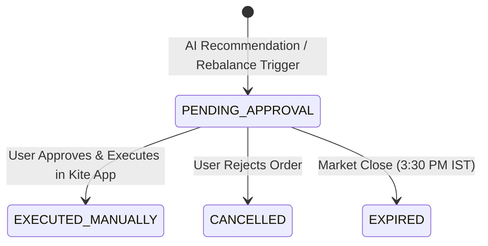

# Order Staging & Safety Guard Skill

This skill defines the security architecture, human-in-the-loop validation patterns, and order staging queue standards for Phase 4 of the Portfolio Assistant.

---

## 1. Fundamental Principle: Human-in-the-Loop Guard

> [!CAUTION]
> **Zero Automated Execution:** The system MUST NEVER execute live equity buy/sell orders headlessly via API without explicit, real-time user confirmation. All trade recommendations generated by the AI Advisory engine are routed to an **Order Staging Queue**.

---

## 2. Order Staging Lifecycle

### Staged Order Schema (`src/models/order.py`)
* `order_id`: UUID
* `tradingsymbol`: string (e.g. `"RELIANCE"`)
* `transaction_type`: `"BUY"` | `"SELL"`
* `quantity`: integer
* `order_type`: `"MARKET"` | `"LIMIT"`
* `price`: float (optional limit price)
* `status`: `"PENDING_APPROVAL"` | `"EXECUTED_MANUALLY"` | `"CANCELLED"` | `"EXPIRED"`
* `staged_at`: timestamp

---

## 3. Execution Channels

1. **Kite Publisher Buttons (Free/Personal Mode)**
   - Renders a dynamic Zerodha Kite Publisher widget in the UI.
   - User clicks the button, which redirects to Zerodha's secure order window pre-filled with symbol, quantity, and transaction type. User clicks "Confirm" inside Zerodha.

2. **Telegram & Webhook Alert Notifications**
   - Triggers real-time alerts via Telegram Bot or Webhook when target price conditions or stop-loss breaches occur.
   - Webhook Postback URL: `http://127.0.0.1:8000/api/v1/orders/postback`.
   - Security: Validate request signatures using SHA-256 HMAC tokens.

---

## 4. References & Documentation Links

* [Phase 4 Order Staging & Alerts Plan](file:///home/benoi/Projects/portfolio_assistant/docs/plans/phase_4_order_staging_and_alerts.md)
* [High-Level Architecture (HLD.md)](file:///home/benoi/Projects/portfolio_assistant/docs/architecture/HLD.md)
