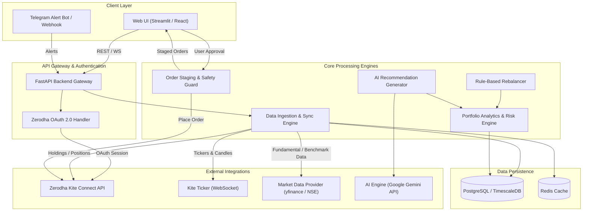
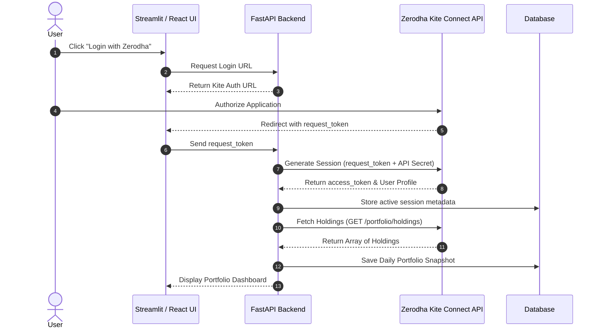
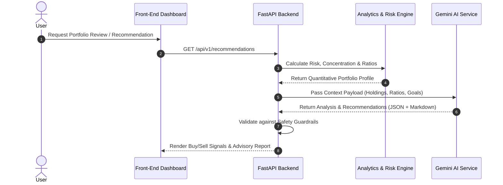
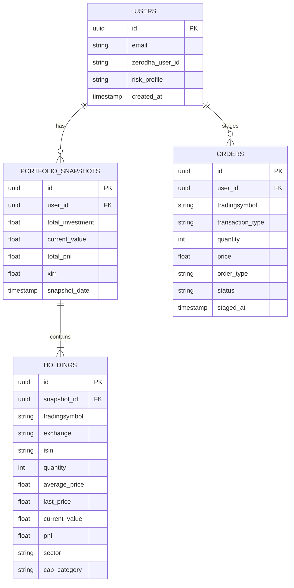

# High-Level Architecture Design (HLD)
## Portfolio Assistant with Zerodha Integration & AI Advisory

---

## 1. Executive Summary & Objectives

### 1.1 Overview
The **Portfolio Assistant** is a personal financial architecture designed to automate portfolio tracking, risk analysis, sector exposure evaluation, and intelligent stock buy/sell recommendations. By integrating with **Zerodha's Kite Connect API**, the application synchronizes live Demat account holdings, positions, and market feeds. It combines deterministic quantitative metrics (Sharpe ratio, Beta, sector concentration, valuation multiples) with Large Language Models (LLMs) to generate personalized portfolio insights and actionable rebalancing recommendations.

### 1.2 Core Objectives
- **Automated Holding Sync**: Daily ingestion of portfolio holdings, cash balance, and current positions from Zerodha Kite Connect API.
- **Portfolio Health & Risk Analytics**: Compute sector concentration, market cap distribution (Large/Mid/Small cap), asset allocation drift, performance metrics (XIRR, CAGR), and volatility exposure.
- **AI-Driven Advisory & Recommendations**: Generate data-backed recommendations (Buy/Sell/Hold/Trim) based on fundamental, technical, and macroeconomic signals using LLM integration (e.g., Google Gemini).
- **Human-in-the-Loop Order Guard**: Provide one-click order staging with explicit user confirmation before executing trades via Zerodha API.
- **Notification & Alerting System**: Trigger real-time alerts for target prices, stop-loss breaches, sector overload, and scheduled rebalancing reports.

---

## 2. System Architecture Overview



---

## 3. Component Architecture Breakdown

### 3.1 Zerodha Integration Layer
- **OAuth Session Manager**: 
  - Generates Kite login URL daily (`https://kite.zerodha.com/connect/login?api_key=...`).
  - Exchanges `request_token` for daily `access_token` via `kite.generate_session()`.
  - Securely caches active session token in memory / Redis (token expires daily at 6 AM).
- **Holdings Sync Worker**: Fetches equity holdings (`GET /portfolio/holdings`) and net positions (`GET /portfolio/positions`).
- **Kite Ticker Service**: WebSocket client connecting to Zerodha's streaming ticker (`wss://ws.kite.trade`) to receive live tick data (LTP, OHLC) for portfolio stocks.

### 3.2 Data Ingestion & Storage Layer
- **Historical Market Data Sync**: Ingests historical daily candles for portfolio holdings and benchmark indices (e.g., NIFTY 50, NIFTY 500) to calculate Beta, CAGR, and volatility.
- **Stock Fundamentals Provider**: Enriches stock data with fundamental ratios (P/E, P/B, Debt/Equity, ROE, Market Cap) fetched via secondary providers (e.g., yfinance or financial data APIs).
- **Time-Series Storage**: Stores daily snapshots of portfolio net worth, stock holdings, and performance metrics.

### 3.3 Analytics & Risk Engine
- **Asset Allocation & Sector Analysis**: Measures portfolio weight per sector (e.g., IT, Banking, Pharma) against pre-configured risk caps (e.g., max 25% single sector).
- **Market Cap Distribution**: Segregates holdings into Large Cap, Mid Cap, and Small Cap categories.
- **Performance Ratios**: Calculates XIRR (Extended Internal Rate of Return), Sharpe Ratio, Sortino Ratio, and Portfolio Beta relative to Nifty 50.
- **Unrealized P&L & Tax Harvesting Analyzer**: Evaluates Short-Term Capital Gains (STCG) vs. Long-Term Capital Gains (LTCG) tax implications for potential sales.

### 3.4 AI Recommendation & Advisory Engine
- **Deterministic Rule Engine**: 
  - Identifies over-concentrated stocks (> 15% of total portfolio value).
  - Flags underperforming stocks breaking 200-day moving average or experiencing continuous earnings deterioration.
  - Identifies rebalancing opportunities based on target model portfolio allocations.
- **LLM Context Synthesis (Gemini Integration)**:
  - Formulates structured prompt payloads containing anonymized stock symbols, entry price, current allocation %, financial ratios, and user investment goals (e.g., Moderate Growth, Long-Term Wealth Creation).
  - Generates plain-English narrative summaries, strategic advice, buy/sell rationales, and risk alerts.
- **Guardrails**: Filters LLM recommendations against strict quantitative rules (e.g., rejecting any LLM recommendation that suggests putting > 20% in a micro-cap stock).

### 3.5 Order Staging & Safety Guard
- **Human-in-the-Loop Confirmation**: The system **never** places direct trades automatically. All suggested buys/sells are added to an "Order Staging Queue".
- **Validation Rules**:
  - Max order value ceiling.
  - Limit price checks (slippage protection).
  - Available margin verification (`GET /user/margins`).
- **Execution Engine**: Sends approved limit/market orders to Zerodha (`POST /orders/regular`).

---

## 4. Data Flow & Sequence Diagrams

### 4.1 Daily Authentication & Holdings Sync Sequence



### 4.2 Portfolio Analysis & AI Advice Flow



---

## 5. Zerodha Kite Connect API Specification

| Endpoint | Method | Purpose | Rate Limit |
| :--- | :--- | :--- | :--- |
| `/session/token` | POST | Exchange request token for access token | 3 req/sec |
| `/portfolio/holdings` | GET | Retrieve user demat long-term holdings | 3 req/sec |
| `/portfolio/positions` | GET | Retrieve intra-day & F&O positions | 3 req/sec |
| `/user/margins` | GET | Check available funds / cash margin | 3 req/sec |
| `/instruments` | GET | Master instrument dump (stocks, ETFs, indices) | 1 req/day |
| `/quote` | GET | Retrieve full market quote (LTP, OHLC, depth) | 1 req/sec |
| `/orders/regular` | POST | Stage / Place buy or sell order | 10 req/sec |

> [!IMPORTANT]
> **Kite Connect Rate Limits**: The Kite API enforces a strict rate limit of 3 requests/second for standard endpoints and 1 request/second for bulk quote calls. Caching layer (Redis) is mandatory for quote data.

---

## 6. Security, Compliance & Risk Management

> [!CAUTION]
> **API Credentials & Trading Safety**
> - **API Key & Secret**: Must be stored strictly in environment variables or secure key vaults (`.env`, HashiCorp Vault, AWS Secrets Manager). Never commit credentials to version control.
> - **Order Safety**: Always implement a **Human-in-the-Loop** model. Automated trading without explicit user authorization creates severe financial and regulatory risk.
> - **Financial Disclaimer**: The application operates as a personal decision-support system, not a SEBI-registered investment advisor (RIA). Clear disclaimers must be shown in the UI.

---

## 7. Recommended Technology Stack

| Layer | Technology Choice | Rationale |
| :--- | :--- | :--- |
| **Backend Framework** | Python (FastAPI) | High-performance async Python backend, native support for Pydantic data schemas. |
| **Kite Connect SDK** | `kiteconnect` (Official Python SDK) | Official maintained Python client for Zerodha API. |
| **Data Analytics** | Pandas, NumPy, `PyPortfolioOpt` | Efficient matrix math, Sharpe ratio calculation, and portfolio optimization algorithms. |
| **AI / LLM Service** | Google Gemini API (`google-genai`) | High-context, structured JSON output capabilities for portfolio analysis. |
| **Database** | PostgreSQL + SQLAlchemy / Alembic | Robust relational schema for portfolio snapshots, transactions, and user settings. |
| **Caching Layer** | Redis | Caching stock quotes, session tokens, and rate-limit counters. |
| **Frontend Framework** | Streamlit (Phase 1) / Next.js (Phase 2) | Streamlit for rapid dashboard MVP; Next.js + Tailwind + Recharts for production UI. |

---

## 8. Database Schema Architecture



---

## 9. Project Directory Structure

```text
portfolio_assistant/
├── docs/
│   ├── HLD.md                  # High-Level System Architecture Document
│   └── plans/                  # Implementation plans per phase
│       ├── phase_1_authentication_and_holdings.md
│       ├── phase_2_fundamental_and_sector_analytics.md
│       ├── phase_3_ai_advisory_engine.md
│       └── phase_4_order_staging_and_alerts.md
├── src/
│   ├── api/                    # FastAPI routes & endpoints
│   ├── core/                   # Config & security
│   ├── services/               # Zerodha client & business logic
│   └── ui/                     # Streamlit frontend app
├── requirements.txt            # Python dependencies
└── README.md                   # Setup & developer guide
```

---

## 10. Phased Implementation Roadmap

### Phase 1: Authentication & Holdings Ingestion (MVP)
- Implement Zerodha OAuth 2.0 login flow.
- Setup FastAPI server with SQLite/PostgreSQL database.
- Fetch, parse, and display current holdings and net worth summary on a Streamlit UI dashboard.

### Phase 2: Fundamental & Sector Analytics Engine
- Integrate stock metadata enricher (sector mapping, market cap classification).
- Compute sector exposure, single-stock concentration risk, and asset allocation breakdown.
- Calculate portfolio XIRR, unrealized gain/loss, and STCG/LTCG tax breakdown.

### Phase 3: AI Advisory & Recommendation Engine
- Integrate Google Gemini API with tailored financial prompt engineering.
- Implement deterministic rule engine for concentration limits and rebalancing signals.
- Generate structured Buy / Sell / Hold recommendations with rationale.

### Phase 4: Order Staging Guard & Notification System
- Implement human-in-the-loop Order Staging Queue.
- Add Zerodha order placement integration with pre-trade safety limits.
- Add Telegram bot / Email alerts for weekly portfolio reviews and stop-loss triggers.
