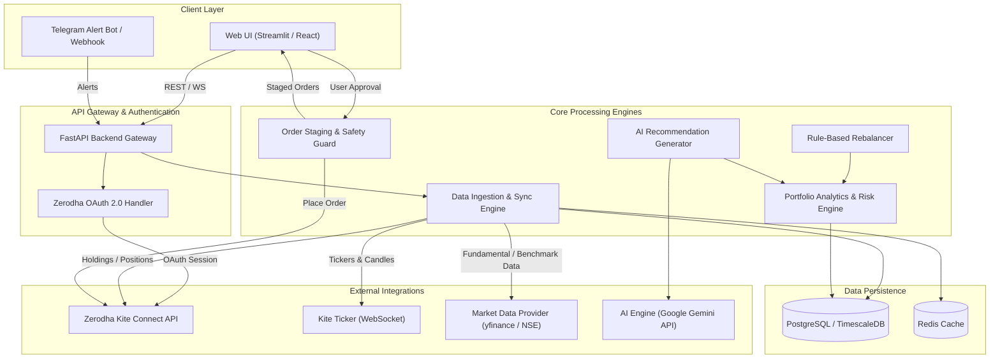
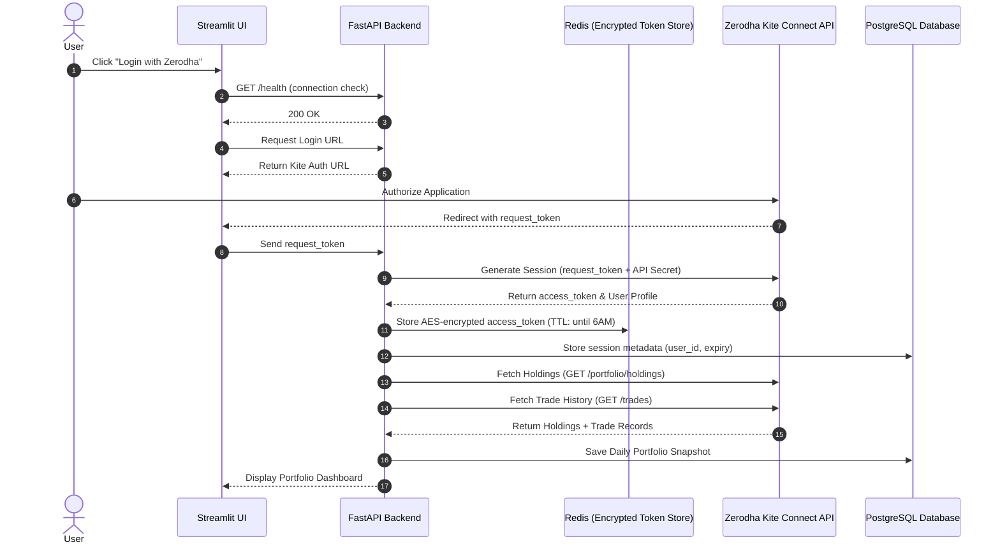
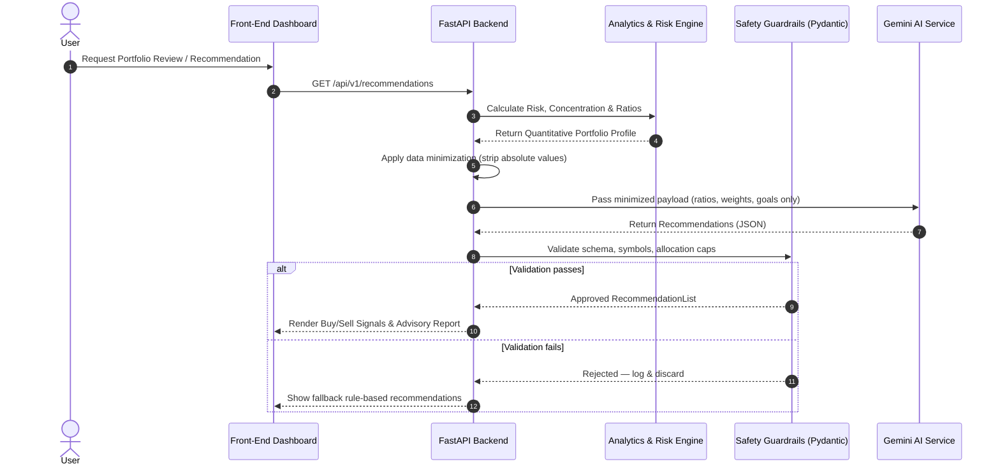
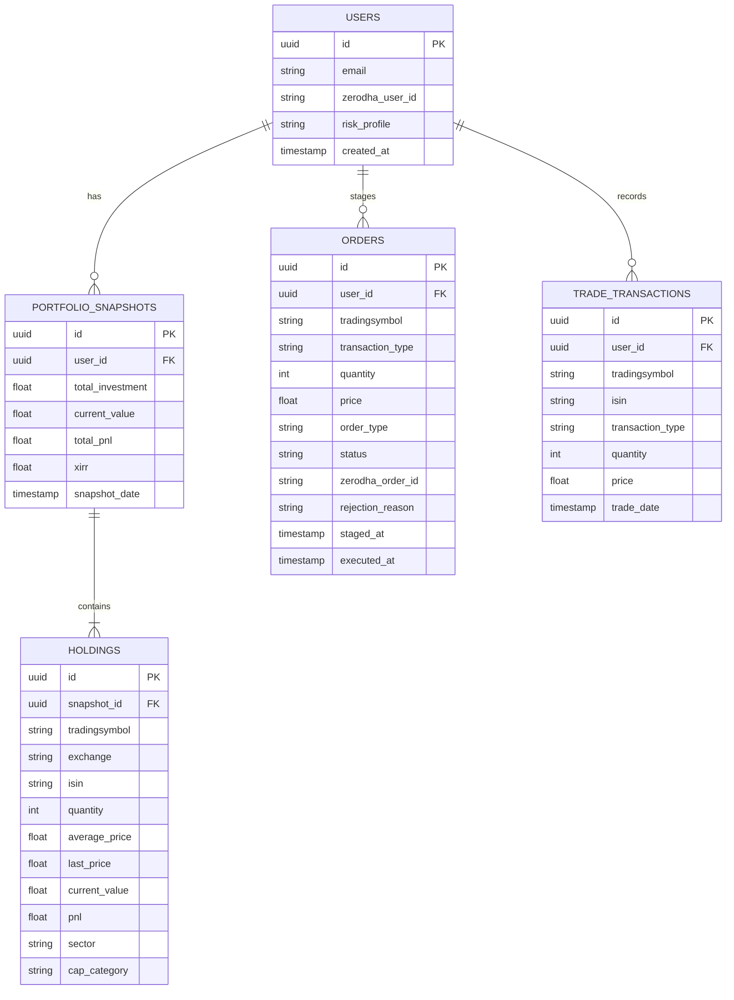

# High-Level Architecture Design (HLD)
## Portfolio Assistant with Zerodha Integration & AI Advisory

---

## 1. Executive Summary & Objectives

### 1.1 Overview
The **Portfolio Assistant** is a personal financial architecture designed to automate portfolio tracking, risk analysis, sector exposure evaluation, and intelligent stock buy/sell recommendations. By integrating with **Zerodha's Kite Connect API**, the application synchronizes live Demat account holdings, positions, and market feeds. It combines deterministic quantitative metrics (Sharpe ratio, Beta, sector concentration, valuation multiples) with Large Language Models (LLMs) to generate personalized portfolio insights and actionable rebalancing recommendations.

### 1.2 Core Objectives
- **Automated Holding Sync**: Daily ingestion of portfolio holdings, cash balance, and current positions from Zerodha Kite Connect API.
- **Portfolio Health & Risk Analytics**: Compute sector concentration, market cap distribution (Large/Mid/Small cap), asset allocation drift, performance metrics (XIRR, CAGR), and volatility exposure.
- **AI-Driven Advisory & Recommendations**: Generate data-backed recommendations (Buy/Sell/Hold/Trim) based on fundamental, technical, and macroeconomic signals using LLM integration (e.g., Google Gemini).
- **Human-in-the-Loop Order Guard**: Provide one-click order staging with explicit user confirmation before executing trades via Zerodha API.
- **Notification & Alerting System**: Trigger real-time alerts for target prices, stop-loss breaches, sector overload, and scheduled rebalancing reports.

---

## 2. System Architecture Overview



---

## 3. Component Architecture Breakdown

### 3.1 Zerodha Integration Layer
- **OAuth Session Manager**: 
  - Generates Kite login URL daily (`https://kite.zerodha.com/connect/login?api_key=...`).
  - Exchanges `request_token` for daily `access_token` via `kite.generate_session()`.
  - Token is AES-encrypted before storage in Redis. The raw token is never persisted in plaintext. For production deployments, use AWS Secrets Manager or HashiCorp Vault.
  - Token expires daily at 6 AM IST. A proactive re-auth reminder notification is triggered at 5:30 AM to prevent silent session failures.
- **Holdings Sync Worker**: Fetches equity holdings (`GET /portfolio/holdings`), net positions (`GET /portfolio/positions`), and trade history (`GET /trades`) for XIRR cash flow reconstruction.
- **Kite Ticker Service**: WebSocket client connecting to Zerodha's streaming ticker (`wss://ws.kite.trade`) to receive live tick data (LTP, OHLC) for portfolio stocks.
- **Rate Limit Guard**: All Kite API calls are wrapped with `tenacity` retry decorators (exponential backoff, max 3 retries) and a token-bucket rate limiter to enforce the 3 req/sec ceiling proactively.

### 3.2 Data Ingestion & Storage Layer
- **Historical Market Data Sync**: Ingests historical daily candles for portfolio holdings and benchmark indices (e.g., NIFTY 50, NIFTY 500) to calculate Beta, CAGR, and volatility.
- **Stock Fundamentals Provider**: Enriches stock data with fundamental ratios (P/E, P/B, Debt/Equity, ROE, Market Cap) using a tiered provider chain:
  1. **Primary**: Paid/official API (Twelve Data or Polygon.io) for reliability and SLA guarantees.
  2. **Fallback**: `yfinance` for non-critical or cached lookups only. Not used as a primary source due to its unofficial scraper nature and lack of SLA.
  - All fundamental data is cached with a 24-hour TTL to minimize external API calls.
- **Background Job Scheduler**: `APScheduler` manages all recurring background tasks:
  - Daily (market open): Holdings sync, fundamentals refresh.
  - Daily (5:30 AM): Zerodha re-auth reminder.
  - Weekly (Sunday): Portfolio digest notification dispatch.
  - On-demand: Historical candle download, order status polling.
- **Time-Series Storage**: Stores daily snapshots of portfolio net worth, stock holdings, and performance metrics.

### 3.3 Analytics & Risk Engine
- **Asset Allocation & Sector Analysis**: Measures portfolio weight per sector (e.g., IT, Banking, Pharma) against pre-configured risk caps (e.g., max 25% single sector).
- **Market Cap Distribution**: Segregates holdings into Large Cap, Mid Cap, and Small Cap categories.
- **Performance Ratios**: Calculates XIRR (Extended Internal Rate of Return), Sharpe Ratio, Sortino Ratio, and Portfolio Beta relative to Nifty 50.
- **Unrealized P&L & Tax Harvesting Analyzer**: Evaluates Short-Term Capital Gains (STCG) vs. Long-Term Capital Gains (LTCG) tax implications for potential sales.

### 3.4 AI Recommendation & Advisory Engine
- **Deterministic Rule Engine**: 
  - Identifies over-concentrated stocks (> 15% of total portfolio value).
  - Flags underperforming stocks breaking 200-day moving average or experiencing continuous earnings deterioration.
  - Identifies rebalancing opportunities based on target model portfolio allocations.
- **LLM Context Synthesis (Gemini Integration)**:
  - Applies data minimization before constructing the prompt: only relative weights (%), financial ratios (P/E, ROE), and risk category are sent. Absolute monetary values (entry price, invested amount) are never included in the LLM payload.
  - Structured JSON prompt template sent to `gemini-2.0-flash`. Output is parsed into a Pydantic `RecommendationList` schema.
  - **Alternative**: For stricter data privacy, a self-hosted model (Ollama + Mistral) can replace Gemini with no data leaving the local environment.
- **Guardrails**: LLM output is validated via Pydantic before use:
  - `action` must be one of `BUY | SELL | HOLD | TRIM`.
  - `confidence_score` must be a float in `[0.0, 1.0]`.
  - `symbol` must exist in the current holdings list (prevents hallucinated tickers).
  - `target_allocation_pct` sum across all recommendations must not exceed 100%.
  - No single small/micro-cap allocation may exceed 20%.
  - Any response failing validation is rejected and logged.

### 3.5 Order Staging & Safety Guard
- **Human-in-the-Loop Confirmation**: The system **never** places direct trades automatically. All suggested buys/sells are added to an "Order Staging Queue" persisted in PostgreSQL.
- **Validation Rules**:
  - Max order value ceiling.
  - Limit price checks (slippage protection).
  - Available margin verification (`GET /user/margins`).
- **Execution Engine**: Sends approved limit/market orders to Zerodha (`POST /orders/regular`). The returned `order_id` is stored immediately.
- **Order Status Polling**: After submission, a background job polls `GET /orders/{order_id}` to track lifecycle transitions (`OPEN` → `COMPLETE` → `REJECTED`/`CANCELLED`) and syncs final status back to the DB. A notification is dispatched on `COMPLETE` or `REJECTED`.

---

## 4. Data Flow & Sequence Diagrams

### 4.1 Daily Authentication & Holdings Sync Sequence



### 4.2 Portfolio Analysis & AI Advice Flow



---

## 5. Zerodha Kite Connect API Specification

| Endpoint | Method | Purpose | Rate Limit |
| :--- | :--- | :--- | :--- |
| `/session/token` | POST | Exchange request token for access token | 3 req/sec |
| `/portfolio/holdings` | GET | Retrieve user demat long-term holdings | 3 req/sec |
| `/portfolio/positions` | GET | Retrieve intra-day & F&O positions | 3 req/sec |
| `/user/margins` | GET | Check available funds / cash margin | 3 req/sec |
| `/instruments` | GET | Master instrument dump (stocks, ETFs, indices) | 1 req/day |
| `/quote` | GET | Retrieve full market quote (LTP, OHLC, depth) | 1 req/sec |
| `/orders/regular` | POST | Stage / Place buy or sell order | 10 req/sec |
| `/orders/{order_id}` | GET | Poll order lifecycle status | 3 req/sec |
| `/trades` | GET | Retrieve historical trade book for XIRR | 3 req/sec |

> [!IMPORTANT]
> **Kite Connect Rate Limits**: The Kite API enforces a strict rate limit of 3 requests/second for standard endpoints and 1 request/second for bulk quote calls. Caching layer (Redis) is mandatory for quote data. All API calls must use `tenacity` retry with exponential backoff and a token-bucket rate limiter at the service layer.

---

## 6. Security, Compliance & Risk Management

> [!CAUTION]
> **API Credentials & Trading Safety**
> - **API Key & Secret**: Must be stored strictly in environment variables or secure key vaults (`.env`, HashiCorp Vault, AWS Secrets Manager). Never commit credentials to version control.
> - **Session Token**: AES-encrypt the Zerodha `access_token` before storing in Redis. Never store the raw token in plaintext in any cache or database.
> - **LLM Data Privacy**: Apply data minimization before sending any data to external LLM APIs. Only relative portfolio weights and financial ratios are permitted in LLM payloads. Absolute monetary values must be stripped. Review and accept the LLM provider's data processing terms.
> - **Order Safety**: Always implement a **Human-in-the-Loop** model. Automated trading without explicit user authorization creates severe financial and regulatory risk.
> - **Observability**: All order staging, approval, and execution events must be logged with full context using structured logging (`structlog`) as a financial audit trail. A `request_id` must be propagated from FastAPI middleware through all downstream service calls.
> - **Financial Disclaimer**: The application operates as a personal decision-support system, not a SEBI-registered investment advisor (RIA). Clear disclaimers must be shown in the UI.

---

## 7. Recommended Technology Stack

| Layer | Technology Choice | Rationale |
| :--- | :--- | :--- |
| **Backend Framework** | Python (FastAPI) | High-performance async Python backend, native support for Pydantic data schemas. |
| **Kite Connect SDK** | `kiteconnect` (Official Python SDK) | Official maintained Python client for Zerodha API. |
| **Data Analytics** | Pandas, NumPy, `PyPortfolioOpt` | Efficient matrix math, Sharpe ratio calculation, and portfolio optimization algorithms. |
| **AI / LLM Service** | Google Gemini API (`google-genai`) | High-context, structured JSON output capabilities for portfolio analysis. |
| **Database** | PostgreSQL + SQLAlchemy / Alembic | Robust relational schema for portfolio snapshots, transactions, and user settings. |
| **Caching Layer** | Redis | Caching stock quotes, session tokens, and rate-limit counters. |
| **Frontend Framework** | Streamlit | Streamlit for the full MVP through Phase 4. A migration to a production UI framework (e.g., Next.js) is deferred to a future phase with explicit scope. |
| **Job Scheduler** | `APScheduler` | Lightweight in-process scheduler for daily sync, weekly digest, and order polling jobs. No broker required for single-user deployment. |
| **Retry & Rate Limiting** | `tenacity` | Declarative retry-with-backoff decorators on all external API calls. |
| **Logging** | `structlog` | Structured JSON logging with `request_id` propagation for audit trails and debugging. |

---

## 8. Database Schema Architecture



---

## 9. Project Directory Structure

```text
portfolio_assistant/
├── docs/
│   ├── HLD.md                  # High-Level System Architecture Document
│   └── plans/                  # Implementation plans per phase
│       ├── phase_1_authentication_and_holdings.md
│       ├── phase_2_fundamental_and_sector_analytics.md
│       ├── phase_3_ai_advisory_engine.md
│       └── phase_4_order_staging_and_alerts.md
├── src/
│   ├── api/                    # FastAPI routes & endpoints
│   ├── core/                   # Config & security
│   ├── services/               # Zerodha client & business logic
│   └── ui/                     # Streamlit frontend app
├── requirements.txt            # Python dependencies
└── README.md                   # Setup & developer guide
```

---

## 10. Phased Implementation Roadmap

### Phase 1: Authentication & Holdings Ingestion (MVP)
- Implement Zerodha OAuth 2.0 login flow with AES-encrypted token storage in Redis.
- Setup FastAPI server with **PostgreSQL + SQLAlchemy + Alembic** from day one (no SQLite).
- Add `GET /health` endpoint and Streamlit connection status indicator.
- Fetch, parse, and display current holdings and net worth summary on a Streamlit UI dashboard.
- Wrap all Kite API calls with `tenacity` retry and rate limiter.
- Implement structured logging with `structlog` and `request_id` propagation.

### Phase 2: Fundamental & Sector Analytics Engine
- Integrate stock metadata enricher using a tiered provider chain (Twelve Data primary, yfinance fallback).
- Ingest trade history via `GET /trades` to supply XIRR cash flow inputs.
- Compute sector exposure, single-stock concentration risk, and asset allocation breakdown.
- Calculate portfolio XIRR, unrealized gain/loss, and STCG/LTCG tax breakdown.
- Introduce `APScheduler` for daily holdings sync and weekly digest scheduling.

### Phase 3: AI Advisory & Recommendation Engine
- Apply data minimization policy before constructing LLM payloads (ratios and weights only, no absolute values).
- Integrate Google Gemini API with tailored financial prompt engineering.
- Implement deterministic rule engine for concentration limits and rebalancing signals.
- Enforce full Pydantic guardrail validation on all LLM responses (symbol existence, action enum, allocation caps).
- Generate structured Buy / Sell / Hold recommendations with rationale.

### Phase 4: Order Staging Guard & Notification System
- Implement human-in-the-loop Order Staging Queue persisted in PostgreSQL.
- Add Zerodha order placement integration with pre-trade safety limits.
- Implement order status polling job (`GET /orders/{order_id}`) to track full order lifecycle.
- Add Telegram bot / Email alerts for weekly portfolio reviews, stop-loss triggers, order completion, and rejection events.

### Phase 5: Production UI (Future)
- Migrate from Streamlit to a production-grade frontend (e.g., Next.js + Tailwind + Recharts).
- Define OpenAPI contract between FastAPI backend and new frontend before implementation begins.
