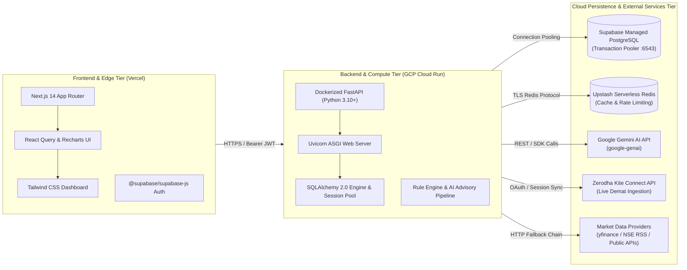
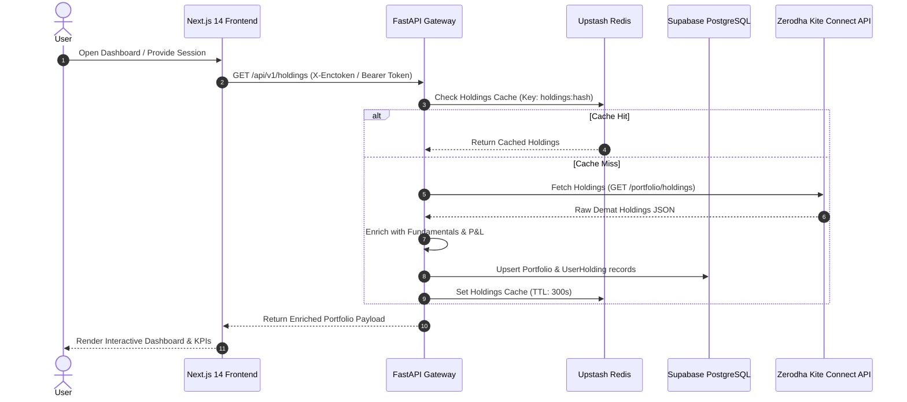
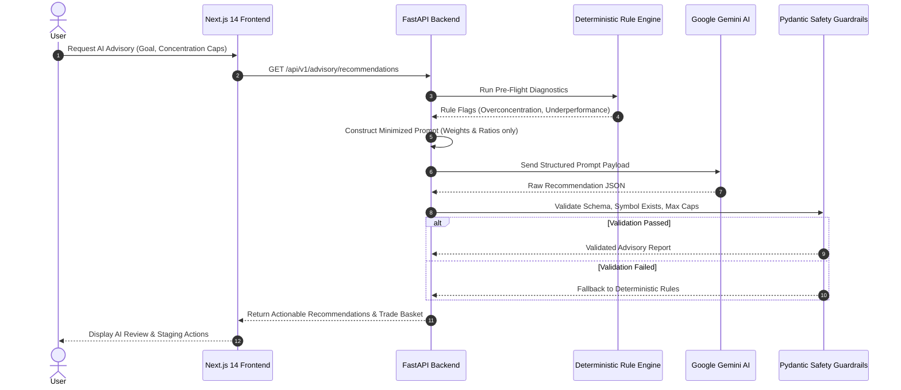
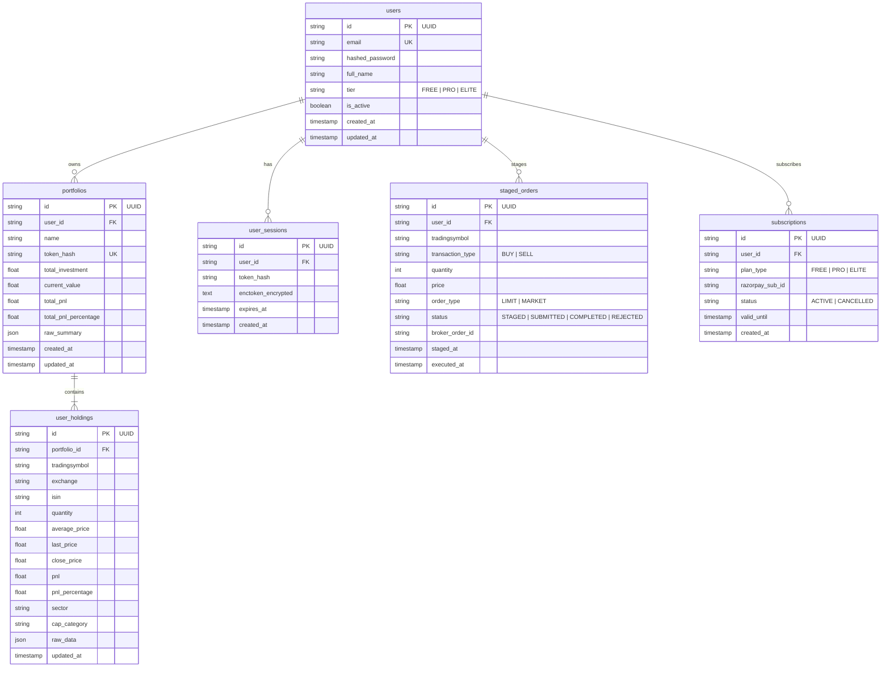

# High-Level Architecture Design (HLD)
## Portfolio Assistant — Multi-Tenant Hybrid Cloud Architecture

---

## 1. Executive Summary & Objectives

### 1.1 Overview
The **Portfolio Assistant** is a modern, cloud-native financial intelligence platform designed to automate portfolio tracking, fundamental and quantitative risk analysis, capital gains tax optimization, and AI-driven stock advisory recommendations.

By integrating with Indian broker APIs (starting with **Zerodha Kite Connect**) and universal statement parsers (CAS PDF / Broker CSVs), the platform synchronizes Demat account holdings, positions, and market feeds. It pairs deterministic quantitative analytics (XIRR, Sharpe ratio, Sortino, Beta, sector concentration) with Large Language Models (LLMs like **Google Gemini**) to generate personalized rebalancing insights and human-in-the-loop staged execution orders.

### 1.2 Core Objectives
- **Universal & Broker-Integrated Sync**: Real-time Demat sync via Zerodha Kite Connect and universal ingestion (CAS PDF / Broker CSVs).
- **Portfolio Health & Risk Analytics**: Real-time evaluation of sector concentration, market cap distribution (Large/Mid/Small cap), asset allocation drift, performance metrics (XIRR, CAGR), and volatility exposure.
- **AI-Driven Advisory & Recommendations**: Generate data-backed recommendations (Buy/Sell/Hold/Trim) based on fundamental, technical, and macroeconomic signals using Google Gemini API with strict Pydantic guardrails.
- **Human-in-the-Loop Order Guard**: Provide one-click order staging with explicit user confirmation before executing trades via broker APIs.
- **Tax-Loss Harvesting Analyzer**: Real-time calculation of realized and unrealized STCG/LTCG with tax-loss harvesting candidate recommendations.
- **Multi-Tenant SaaS Foundation**: Secure user authentication (Supabase Auth / Google OAuth), user-isolated data persistence, and tiered SaaS monetization.

---

## 2. Hybrid Butterfly System Architecture

The system utilizes a decoupled, serverless **Hybrid Cloud Architecture** ensuring zero infrastructure maintenance costs, instant global CDN delivery, and automatic scaling:



---

## 3. Component Architecture Breakdown

### 3.1 Broker Integration & Ingestion Layer
- **Zerodha Kite Connect SDK**:
  - Web session login (`enctoken`) and official Kite OAuth 2.0 API flows.
  - Holdings worker fetching Demat equity holdings (`GET /portfolio/holdings`) and positions.
  - Rate limiting & tenacity retry: Exponential backoff with jitter on all broker calls.
- **Universal Statement Parsers (Phase 6)**:
  - CDSL/NSDL CAS PDF statement parser for universal broker ingestion.
  - Standard broker CSV uploaders (Zerodha Console, Groww, ICICI Direct).

### 3.2 Data Persistence & Caching Layer
- **Managed PostgreSQL (Supabase)**:
  - Primary persistent relational store with connection pooling (Transaction mode port `6543`).
  - Version-controlled schema migrations managed via **Alembic**.
  - Encrypted broker session storage and user-isolated portfolio tables.
- **Serverless Redis (Upstash)**:
  - In-memory cache for market quotes, enriched fundamentals, and AI advisory reports.
  - Sliding-window rate limiting for API quota management.
  - Automatic graceful degradation to local memory/disk cache during offline or testing modes.

### 3.3 Analytics & Quantitative Risk Engine
- **Asset Allocation & Sector Analysis**: Measures portfolio weights across sectors against user-defined risk caps (e.g., max 25% single sector).
- **Market Cap Segregation**: Categorizes assets into Large Cap, Mid Cap, and Small Cap classes.
- **Deterministic Metrics**: Computes portfolio XIRR, Sharpe Ratio, Sortino Ratio, and Portfolio Beta against the NIFTY 50 benchmark.
- **Indian Income Tax Harvesting Engine**: Classifies realized and unrealized gains into STCG (20%) and LTCG (12.5% beyond ₹1.25L exemption under Budget 2024 rules).

### 3.4 Multi-Stage AI Advisory Engine
- **Deterministic Rule Engine**: Flags over-concentration (>15%), underperforming assets breaking 200-day moving averages, and sector overweights.
- **LLM Context Synthesis (Google Gemini API)**:
  - Applies strict data minimization: only relative weights (%), financial ratios (P/E, ROE), and macro news context are sent to LLM payloads. Absolute monetary balances are stripped.
  - Structured prompt contracts using `gemini-2.0-flash` or `gemini-3.1-flash-lite`.
- **Pydantic Guardrails**:
  - Enforces valid action enums (`BUY | SELL | HOLD | TRIM`).
  - Hallucination prevention: Symbols must strictly exist in the portfolio or target universe.
  - Risk caps: Single small/micro-cap allocation cannot exceed 20%. Total target allocation sums to 100%.

### 3.5 Order Staging & Safety Guard (Phase 4)
- **Human-in-the-Loop Trade Queue**: Suggestions are placed in an Order Staging Queue in PostgreSQL with explicit user confirmation required before submission.
- **Pre-Trade Safety Limits**: Maximum single-order ceiling, slippage protection, and margin checks.

---

## 4. Sequence & Data Flow Diagrams

### 4.1 Authentication, Holdings Ingestion & DB Persistence



### 4.2 AI Advisory & Rebalancing Flow



---

## 5. Technology Stack Specification

| Component | Technology Choice | Hosting / Deployment | Free Tier / Production Capability |
|---|---|---|---|
| **Frontend Framework** | Next.js 14 (App Router, TypeScript, Tailwind, Recharts) | **Vercel** | Edge CDN, 100GB bandwidth/mo free |
| **Backend Framework** | Python (FastAPI, Uvicorn, Pydantic v2) | **GCP Cloud Run** | Serverless containers, 2M req/mo free |
| **Database & Identity** | PostgreSQL 16 + Supabase Auth | **Supabase** | 500MB DB, 50,000 MAU free tier |
| **ORM & Migrations** | SQLAlchemy 2.0 + Alembic | In-App / Backend | Fully version-controlled DDL migrations |
| **Cache & Rate Limits** | Redis | **Upstash Redis** | Serverless Redis, 10,000 req/day free |
| **AI Advisory Engine** | Google Gemini API (`google-genai`) | Managed API | High context window & structured JSON |
| **Broker Integration** | Kite Connect SDK (`kiteconnect`) | Backend Service | Live Zerodha Demat sync |
| **Testing & CI/CD** | `unittest`, `run_dev.sh`, GitHub Actions | Local & Cloud | Automated test-before-boot pipeline |

---

## 6. Database Schema Architecture (PostgreSQL)



---

## 7. Project Directory Structure

```text
portfolio_assistant/
├── backend/                        # FastAPI Backend Application
│   ├── alembic/                    # Database migration scripts & versions
│   │   ├── versions/
│   │   │   └── 0001_initial_schema.py
│   │   └── env.py
│   ├── src/
│   │   ├── api/                    # REST routers (auth, holdings, analytics, advisory)
│   │   ├── core/                   # Config, logging, cache, retry
│   │   ├── db/                     # Base & SQLAlchemy session pool manager
│   │   ├── models/                 # SQLAlchemy 2.0 ORM models (User, Portfolio, Holding, Session)
│   │   ├── services/               # Zerodha client, market data, rebalancer, LLM advisor
│   │   └── main.py                 # FastAPI application bootstrap & health probes
│   ├── tests/                      # Automated unit & integration tests
│   ├── requirements.txt            # Python dependencies
│   ├── alembic.ini                 # Alembic configuration
│   └── run_dev.sh                  # Development startup script (test-before-boot)
│
├── frontend/                       # Next.js 14 React Dashboard Application
│   ├── app/                        # App router pages (dashboard, login, settings)
│   ├── components/                 # React components (tabs, KPIs, charts, header, sidebar)
│   ├── hooks/                      # React Query & custom data hooks
│   ├── lib/                        # Axios client, types, utility helpers
│   ├── package.json
│   └── tailwind.config.ts
│
├── docs/                           # Architecture, LLD, and Phase Plans
│   ├── architecture/
│   │   ├── HLD.md                  # High-Level Architecture Design (This Document)
│   │   └── HYBRID_DEPLOYMENT_PLAN.md
│   ├── lld/                        # Detailed Low-Level Design documents (00 to 09)
│   └── plans/                      # Phased roadmaps (Phases 1 to 7)
│
└── .agents/                        # Agent Skills, Briefings & Workspace Rules
```

---

## 8. Phased Implementation Roadmap

* **Phase 1: Ingestion & Auth MVP (Completed ✅)**: Zerodha Demat sync, holdings parsing, P&L calculations.
* **Phase 2: Fundamental & Sector Analytics (Completed ✅)**: Market data multi-tier fallback chain, XIRR calculations, STCG/LTCG tax harvesting analyzer.
* **Phase 3: AI Advisory & Recommendation Engine (Completed ✅)**: Rule-based engine, Google Gemini 3-stage advisory pipeline, structured trade basket generation, Pydantic guardrails.
* **Phase 4: Order Staging Guard & Notification System (Next)**: Staged order queue in PostgreSQL, human confirmation gate, Telegram alerts.
* **Phase 5: Production Next.js Dashboard (Completed ✅)**: React 14 + Recharts dashboard with interactive tables, KPI cards, and theme switcher.
* **Phase 6: Multi-Tenant Architecture & Live Cloud Persistence (Active / In Progress 🚀)**: Supabase PostgreSQL database persistence, connection pooling, Alembic migrations, Upstash Redis cache.
* **Phase 7: SaaS Monetization & Entitlements (Upcoming)**: Razorpay subscription webhooks, tier-based rate limiters, premium features.
