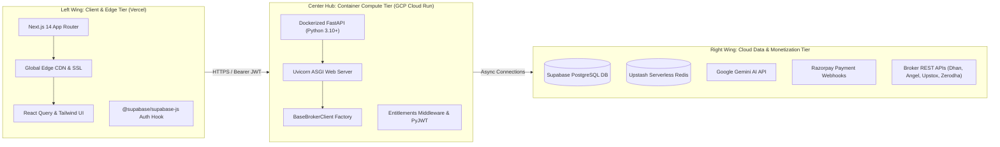
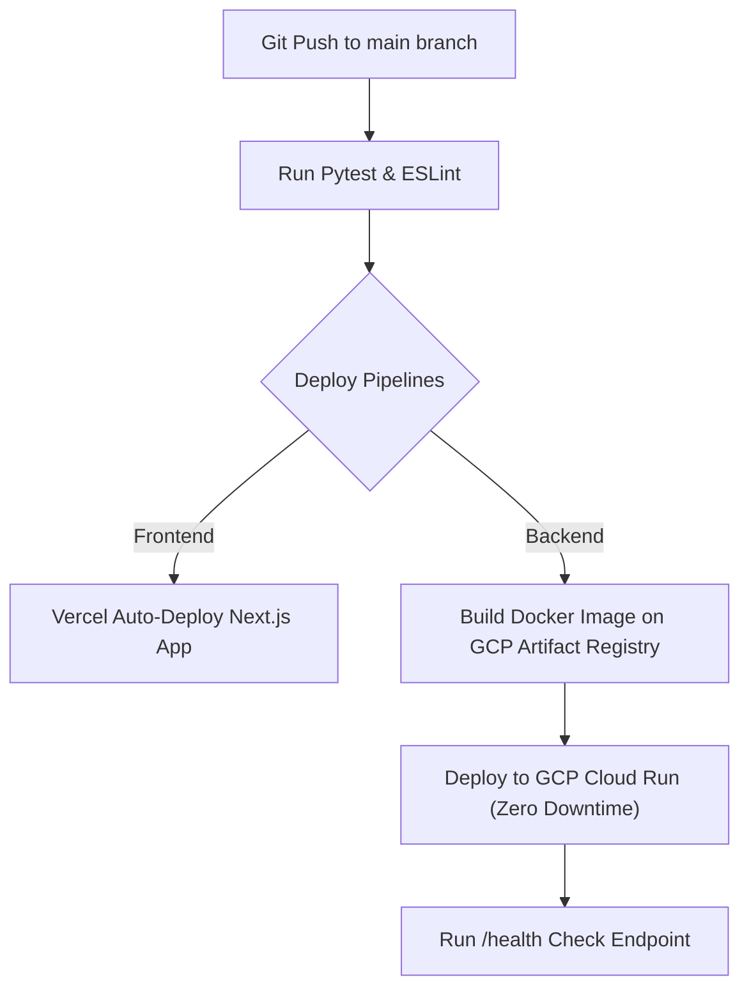

# Hybrid Cloud Deployment & Infrastructure Plan

---

## 1. Executive Summary

This document specifies the production **Hybrid Cloud Deployment Architecture** for **Portfolio Assistant**. By decoupling the Next.js frontend from the Python FastAPI backend, the system achieves maximum performance, zero infrastructure maintenance cost, instant global CDN delivery, and serverless auto-scaling.

### Cloud Infrastructure Stack

| Layer | Provider / Service | Hosting Model | Free Tier Allowance |
|---|---|---|---|
| **Frontend UI** | **Vercel** | Edge Network / Serverless | 100% Free (100GB bandwidth/mo) |
| **Backend API** | **GCP Cloud Run** | Managed Serverless Containers | 2,000,000 req/mo & 360,000 vCPU-sec/mo Free |
| **Database & Auth** | **Supabase** | Managed PostgreSQL + Auth | 50,000 Monthly Active Users & 500MB DB Free |
| **Cache & Rate Limits** | **Upstash Redis** | Serverless Redis | 10,000 requests/day Free |
| **Identity Provider** | **Google Cloud OAuth** | External Identity Provider | 100% Free Unlimited Logins |
| **AI Engine** | **Google Gemini API** | Managed LLM API | Free Tier / Pay-per-token |

---

## 2. Hybrid Butterfly Deployment Architecture



---

## 3. Component Deployment Blueprint

### A. Next.js Frontend on Vercel
- **Repository Link**: Connect GitHub repository root directory `frontend/`.
- **Environment Variables**:
  - `NEXT_PUBLIC_API_BASE_URL`: Point to GCP Cloud Run URL (`https://portfolio-backend-xyz-uc.a.run.app`).
  - `NEXT_PUBLIC_SUPABASE_URL`: Supabase project URL.
  - `NEXT_PUBLIC_SUPABASE_ANON_KEY`: Supabase public anon key.
- **CI/CD Integration**: Vercel automatically deploys preview environments for pull requests and updates production instantly on `git push origin main`.

### B. FastAPI Container Backend on GCP Cloud Run
- **Container Build**: Production multi-stage `Dockerfile` in `backend/`:

```dockerfile
FROM python:3.10-slim
WORKDIR /app
COPY requirements.txt .
RUN pip install --no-cache-dir -r requirements.txt
COPY . .
EXPOSE 8000
CMD ["uvicorn", "src.main:app", "--host", "0.0.0.0", "--port", "8000"]
```

- **GCP Deployment Command**:
```bash
# Build and deploy container to Cloud Run
gcloud run deploy portfolio-assistant-api \
  --source ./backend \
  --platform managed \
  --region asia-south1 \
  --allow-unauthenticated \
  --min-instances 0 \
  --max-instances 10 \
  --memory 512Mi \
  --cpu 1 \
  --set-env-vars SUPABASE_URL="...",SUPABASE_SERVICE_ROLE_KEY="...",GEMINI_API_KEY="..."
```

### C. Database & Identity on Supabase
- **Database**: Hosted PostgreSQL cluster with automatic daily backups.
- **Auth Provider Configuration**:
  - Enable Google Provider under `Supabase Dashboard -> Auth -> Providers -> Google`.
  - Enter `GOOGLE_CLIENT_ID` and `GOOGLE_CLIENT_SECRET` generated from GCP Console.

### D. Redis Cache & Quotas on Upstash
- Serverless REST-compatible Redis instance for multi-tenant rate-limiting and market data caching.
- Connection string injected into FastAPI backend via `REDIS_URL`.

---

## 4. Automated CI/CD Deployment Workflow (GitHub Actions)



---

## 5. Cost & Scale Projection Matrix

| User Scale | Monthly Active Users | Estimated Vercel Cost | Estimated GCP Cloud Run Cost | Estimated DB / Cache Cost | Total Monthly Cost |
|---|---|---|---|---|---|
| **Development** | 1 – 10 users | **₹0 ($0)** | **₹0 ($0)** | **₹0 ($0)** | **₹0 / Month** |
| **Launch MVP** | 1,000 users | **₹0 ($0)** | **₹0 ($0)** | **₹0 ($0)** | **₹0 / Month** |
| **Growth Stage** | 20,000 users | **₹0 ($0)** | **~₹150 ($1.80)** | **₹0 ($0)** | **~₹150 / Month** |
| **Scale SaaS** | 100,000 users | **₹1,600 ($20)** | **~₹1,200 ($14.50)** | **~₹2,000 ($25)** | **~₹4,800 / Month** |
