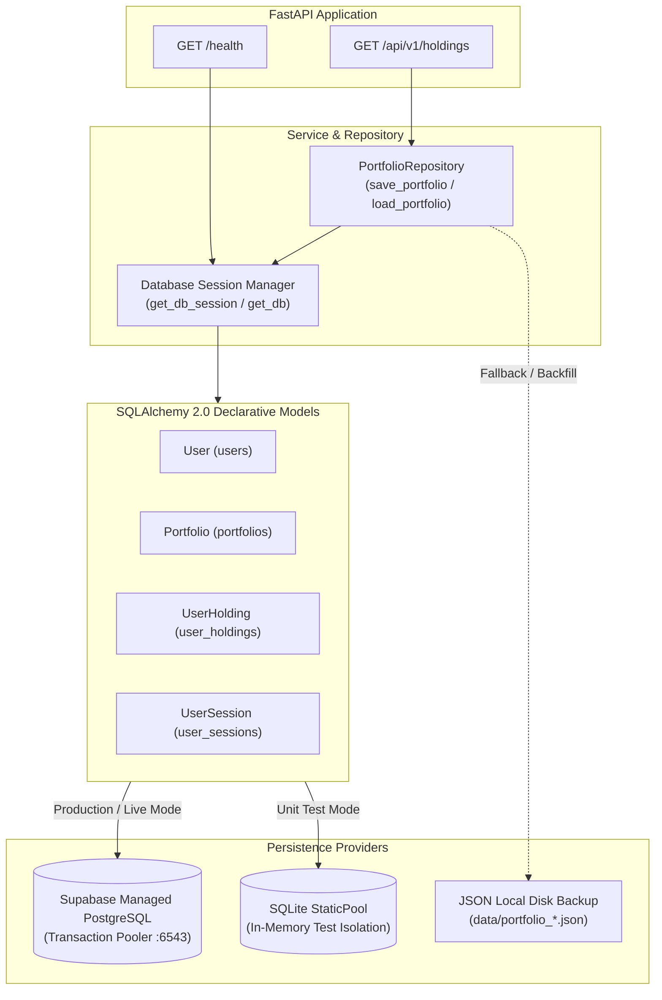

# LLD 09 — Database Persistence & Cloud Storage (Supabase + SQLAlchemy)

**Files covered:**
`backend/src/db/base.py` · `backend/src/db/session.py` · `backend/src/models/*` · `backend/alembic/*` · `backend/src/services/portfolio_repository.py` · `backend/run_dev.sh` · `backend/tests/test_portfolio.py`

**Cross-references:**
- High-level deployment → [HYBRID_DEPLOYMENT_PLAN.md](../architecture/HYBRID_DEPLOYMENT_PLAN.md)
- Multi-tenant architecture → [Phase 6 Plan](../plans/phase_6_multi_tenant_and_universal_ingestion.md)
- Cache layer → [LLD 08](./08_cache_layer.md)

---

## 1. Executive Summary & Architecture

Portfolio Assistant persists long-term portfolios, enriched holding snapshots, user accounts, and session tokens directly into a managed cloud **PostgreSQL (Supabase)** instance via **SQLAlchemy 2.0** and version-controlled **Alembic** migrations.



---

## 2. Database Engine & Session Manager (`src/db/session.py`)

### Connection Pool Configuration
- **Dynamic Dialect Normalization**: Automatically converts `postgres://` or `postgresql://` to `postgresql+psycopg2://`.
- **Pool Resilience**:
  - `pool_pre_ping=True`: Detects stale connections and reconnects before executing queries.
  - `pool_recycle=300`: Periodically recycles idle connections to stay healthy with serverless connection poolers.
  - `pool_size`: Configurable via `DB_POOL_SIZE` (default: 5).
  - `max_overflow`: Configurable via `DB_MAX_OVERFLOW` (default: 10).

### Context Managers & Helpers
```python
# Standalone service transaction context manager
with get_db_session() as db:
    db.add(portfolio)

# FastAPI route dependency
def endpoint(db: Session = Depends(get_db)):
    ...

# Health probe check
is_connected, msg = check_db_connection()
```

---

## 3. SQLAlchemy 2.0 ORM Models (`src/models/`)

| Model | Table | Key Columns | Relationships |
|---|---|---|---|
| `User` | `users` | `id` (UUID pk), `email` (unique index), `hashed_password`, `tier`, `is_active`, `created_at` | Has many `Portfolio`, `UserSession` |
| `Portfolio` | `portfolios` | `id` (UUID pk), `user_id` (FK nullable), `token_hash` (unique index), `total_investment`, `current_value`, `total_pnl`, `total_pnl_percentage`, `raw_summary` (JSON) | Belongs to `User`, Has many `UserHolding` |
| `UserHolding` | `user_holdings` | `id` (UUID pk), `portfolio_id` (FK), `tradingsymbol` (indexed), `exchange`, `isin`, `quantity`, `average_price`, `last_price`, `pnl`, `sector`, `cap_category`, `raw_data` (JSON) | Belongs to `Portfolio` (Cascade Delete) |
| `UserSession` | `user_sessions` | `id` (UUID pk), `user_id` (FK nullable), `token_hash`, `enctoken_encrypted`, `expires_at` | Belongs to `User` |

---

## 4. Repository Layer & Fallback Mechanics (`src/services/portfolio_repository.py`)

- **`save_portfolio(token, portfolio_data)`**:
  1. Computes SHA-256 `token_hash`.
  2. Upserts `Portfolio` record matching `token_hash`.
  3. Atomically clears and replaces all child `UserHolding` rows in a single transaction.
  4. Writes a secondary file backup to `data/portfolio_<hash>.json`.
- **`load_portfolio(token) -> dict`**:
  1. Queries `Portfolio` with eager-loaded `UserHolding` records.
  2. If found, reconstructs the complete dictionary matching the API contract.
  3. If database query fails or is empty, reads from local file backup and **automatically backfills** the data into PostgreSQL.

---

## 5. Development Runner Pipeline (`backend/run_dev.sh`)

Emulates Spring Boot's test-before-run workflow:
1. **Step 1 (Tests)**: Runs full backend unit test suite (`python -m unittest`). If any test fails, aborts boot immediately.
2. **Step 2 (Migrations)**: Runs `alembic upgrade head` to ensure live database schema matches models.
3. **Step 3 (App Boot)**: Launches FastAPI development server with hot-reloading (`uvicorn --reload`).

---

## 6. Comprehensive Test Suite (`tests/test_portfolio.py`)

10 automated tests covering:
1. `test_database_health_check`: Ping connectivity probe.
2. `test_orm_cascade_deletion`: Foreign key cascade delete on child holdings.
3. `test_save_and_direct_db_inspection`: Direct SQL inspection of inserted column types.
4. `test_load_portfolio_reconstruction`: API payload round-trip integrity.
5. `test_multi_user_portfolio_isolation`: Tenant isolation between multiple users.
6. `test_atomic_holding_replacement_on_rebalance`: Zero stale holding leftovers on rebalance.
7. `test_empty_portfolio_handling`: Empty portfolio safety.
8. `test_file_backup_and_db_resynchronization`: Self-healing file-to-DB sync.
9. `test_api_health_endpoint`: `GET /health` probe.
10. `test_api_holdings_and_cache_invalidation`: `GET /api/v1/holdings` and `DELETE /api/v1/cache/invalidate`.
