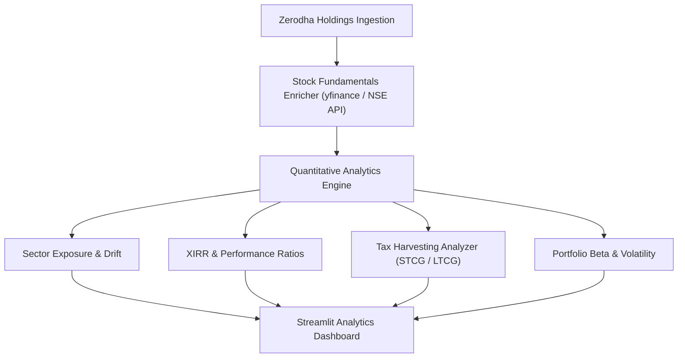

# Implementation Plan - Phase 2: Fundamental & Sector Analytics Engine

---

## 1. Overview & Objectives
Phase 2 enhances the Portfolio Assistant by adding deep quantitative financial analysis. It enriches raw stock symbols with fundamental metrics (P/E ratio, P/B ratio, Dividend Yield, Debt-to-Equity, ROE), calculates portfolio-level performance metrics (XIRR, Sharpe/Sortino ratios, Beta vs. Nifty 50), and analyzes tax harvesting opportunities (STCG vs. LTCG).

> **Key dependency on Phase 1**: XIRR calculation requires historical transaction cash flows sourced from `GET /trades` (Zerodha trade book), which must be ingested and stored in the `trade_transactions` table established in Phase 1.

---

## 2. Technical Architecture & Component Design

---

## 3. Key Components to Build

### 3.1 Market Data & Fundamentals Enricher (`src/services/market_data.py`)
- **NSE-focused tiered provider chain** — all sources are India/NSE-specific:
  1. **Primary**: `jugaad-trader` or `nsepython` — unofficial but widely used Python libraries that scrape NSE's public endpoints for fundamentals (P/E, P/B, 52-week high/low, sector). No API key required.
  2. **Secondary**: `yfinance` with `.NS` suffix — fetches NSE-listed stock data from Yahoo Finance. Unofficial scraper, used as a second fallback.
  3. **Static metadata DB** — hardcoded fundamentals for the most common Nifty 50 / Nifty 500 stocks. Used when both live sources fail (e.g., off-market hours, rate limits).
- All fundamental data (P/E, P/B, ROE, Debt/Equity, Market Cap) is cached in-memory with a **24-hour TTL** to minimize external calls.
- Historical price candle retrieval (1-year daily candles) for Beta and Sharpe ratio computations using Zerodha's own `GET /instruments/historical` endpoint where possible.

> **Why not Twelve Data or Polygon.io?** These are global providers with limited or no NSE coverage on free tiers. NSE-native sources give more accurate sector classifications, market cap categories (SEBI-defined Large/Mid/Small Cap), and Indian corporate action data.

### 3.2 Quantitative Analytics Engine (`src/services/analytics_engine.py`)
- **Portfolio XIRR Calculation**: Computes Extended Internal Rate of Return using historical cash flows from the `trade_transactions` table (buy/sell dates and amounts) against current market value. Does **not** rely solely on current holdings data.
- **Benchmark Comparative Beta**: Measures portfolio volatility against Nifty 50 and Nifty 500 indices.
- **Sharpe & Sortino Ratios**: Evaluates risk-adjusted returns against the Indian 10-Year Government Bond risk-free rate (~7%).

### 3.3 Tax Harvesting Analyzer (`src/services/tax_harvesting.py`)
- Categorizes holding gains into **STCG** (< 1 year holding, 20% tax rate) vs. **LTCG** (> 1 year holding, 12.5% tax rate after ₹1.25 Lakh exemption).
- Identifies loss-making stocks that can be sold to offset realized capital gains before financial year-end.

---

## 4. Proposed File Changes

#### [NEW] `src/services/market_data.py`
- NSE-focused tiered fundamental fetcher: `nsepython` / `jugaad-trader` primary → `yfinance (.NS)` secondary → static metadata DB fallback. In-memory TTL cache (24h).

#### [NEW] `src/services/analytics_engine.py`
- Math routines for XIRR (using `trade_transactions` cash flows), Sharpe, Sortino, Beta, and drawdown metrics.

#### [NEW] `src/services/tax_harvesting.py`
- Tax optimization and capital gains classifier.

#### [NEW] `src/core/scheduler.py` (if not already created in Phase 1)
- Register Phase 2 scheduled jobs:
  - Daily (market open): Fundamentals refresh for all held symbols.
  - Weekly (Sunday 8 AM): Portfolio digest preparation.

#### [MODIFY] `src/api/holdings.py`
- New endpoints: `/api/v1/analytics/performance` and `/api/v1/analytics/tax-harvesting`.

#### [MODIFY] `src/ui/app.py`
- Enhanced analytics UI with XIRR cards, Beta gauge chart, and Tax Loss Harvesting tab.

---

## 5. Verification & Testing Strategy
- Unit tests validating XIRR calculation accuracy against known financial benchmark datasets using mock `trade_transactions` records.
- Mock market data verification for off-market hour testing.
- Verify fallback to `yfinance` triggers correctly when primary provider returns a non-200 response.
- Verify Redis cache hit/miss behavior for fundamentals (TTL expiry simulation).
