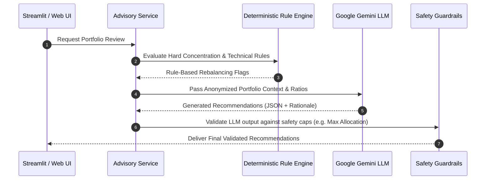

# Implementation Plan - Phase 3: AI Advisory & Recommendation Engine

---

## 1. Overview & Objectives
Phase 3 introduces artificial intelligence to the Portfolio Assistant. By integrating **Google Gemini API (`google-genai`)** alongside a deterministic rule engine, the system synthesizes current Demat holdings, valuation metrics, risk profile, and market conditions to generate personalized, plain-English Buy, Sell, Hold, or Trim recommendations with structured rationales.

---

## 2. Architecture & Hybrid Recommendation Flow

---

## 3. Technical Specifications

### 3.1 Deterministic Rule Engine (`src/services/rebalancer.py`)
- **Over-Concentration Rule**: Flags any stock exceeding 15% of total portfolio value for trimming.
- **Underperformance Rule**: Flags stocks trading below their 200-day simple moving average (SMA) with negative earnings growth.
- **Sector Cap Rule**: Identifies sector exposure exceeding the user's pre-configured limit (e.g., 25%).

### 3.2 LLM Context Prompt Engineering (`src/services/llm_advisor.py`)
- **Data Minimization (mandatory)**: Before constructing the LLM payload, strip all absolute monetary values (entry price, invested amount, current value in ₹). Only the following are permitted in the prompt:
  - Relative portfolio weight (%) per stock
  - Financial ratios (P/E, ROE, Debt/Equity)
  - Market cap category (Large/Mid/Small)
  - User investment goal (e.g., Moderate Growth)
- Structured JSON prompt template sent to `gemini-2.0-flash`.
- Output parsed into Pydantic `RecommendationList` schema: `symbol`, `action`, `target_allocation_pct`, `confidence_score`, `rationale`.
- **Alternative LLM**: For stricter data privacy, the service supports a self-hosted model via Ollama (e.g., Mistral 7B). Configure via `LLM_PROVIDER=ollama` in `.env`.

### 3.3 Safety Guardrails & Validation (`src/services/llm_advisor.py`)
All LLM responses are validated via Pydantic before use. Any response failing validation is **rejected, logged, and discarded** — the system falls back to rule-based recommendations.

| Guardrail | Rule |
| :--- | :--- |
| Action enum | Must be one of `BUY`, `SELL`, `HOLD`, `TRIM` |
| Confidence score | Float in range `[0.0, 1.0]` |
| Symbol existence | Must exist in current holdings list (no hallucinated tickers) |
| Allocation sum | Sum of all `target_allocation_pct` must not exceed 100% |
| Small-cap cap | No single small/micro-cap allocation may exceed 20% |

---

## 4. Proposed File Changes

#### [NEW] `src/services/llm_advisor.py`
- Gemini API integration with data minimization, prompt templates, Pydantic response parser, and Ollama fallback support.

#### [NEW] `src/services/rebalancer.py`
- Deterministic portfolio rebalancing & allocation rules engine.

#### [NEW] `src/api/advisory.py`
- Endpoint: `GET /api/v1/recommendations` and `POST /api/v1/recommendations/evaluate`.

#### [MODIFY] `src/core/config.py`
- Add `LLM_PROVIDER` (`gemini` | `ollama`), `GEMINI_API_KEY`, `OLLAMA_BASE_URL` settings.

#### [MODIFY] `src/ui/app.py`
- Populate Tab 3 with AI Advisory Card, Buy/Sell signals, confidence scores, and natural language explanations.
- Show fallback indicator when rule-based recommendations are used due to LLM validation failure.
