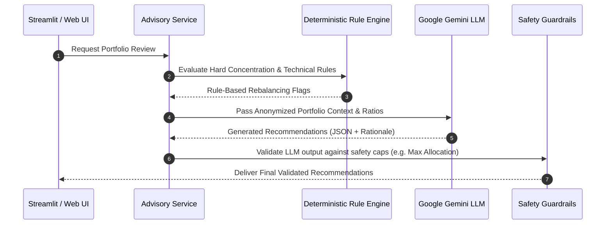

# Implementation Plan - Phase 3: AI Advisory & Recommendation Engine

---

## 1. Overview & Objectives
Phase 3 introduces artificial intelligence to the Portfolio Assistant. By integrating **Google Gemini API (`google-genai`)** alongside a deterministic rule engine, the system synthesizes current Demat holdings, valuation metrics, risk profile, and market conditions to generate personalized, plain-English Buy, Sell, Hold, or Trim recommendations with structured rationales.

---

## 2. Architecture & Hybrid Recommendation Flow

---

## 3. Technical Specifications

### 3.1 Deterministic Rule Engine (`src/services/rebalancer.py`)
- **Over-Concentration Rule**: Flags any stock exceeding 15% of total portfolio value for trimming.
- **Underperformance Rule**: Flags stocks trading below their 200-day simple moving average (SMA) with negative earnings growth.
- **Sector Cap Rule**: Identifies sector exposure exceeding the user's pre-configured limit (e.g., 25%).

### 3.2 LLM Context Prompt Engineering (`src/services/llm_advisor.py`)
- Structured JSON prompt template sent to Gemini LLM (`gemini-1.5-pro` / `gemini-2.0-flash`).
- Payload contains anonymized stock symbols, entry price, current allocation %, fundamental P/E & ROE, and user investment goal.
- Output parsed into structured Pydantic schema: `RecommendationList` containing `symbol`, `action` (`BUY`|`SELL`|`HOLD`|`TRIM`), `target_allocation_pct`, `confidence_score`, and `rationale`.

### 3.3 Safety Guardrails & Validation
- Rejects any LLM suggestion that recommends allocating > 20% to small/micro-cap stocks.
- Ensures total rebalancing action sum preserves cash margin buffer.

---

## 4. Proposed File Changes

#### [NEW] `src/services/llm_advisor.py`
- Gemini API integration with prompt templates & response Pydantic parser.

#### [NEW] `src/services/rebalancer.py`
- Deterministic portfolio rebalancing & allocation rules engine.

#### [NEW] `src/api/advisory.py`
- Endpoint: `GET /api/v1/recommendations` and `POST /api/v1/recommendations/evaluate`.

#### [MODIFY] `src/ui/app.py`
- Populate Tab 3 with AI Advisory Card, Buy/Sell signals, confidence scores, and natural language explanations.
