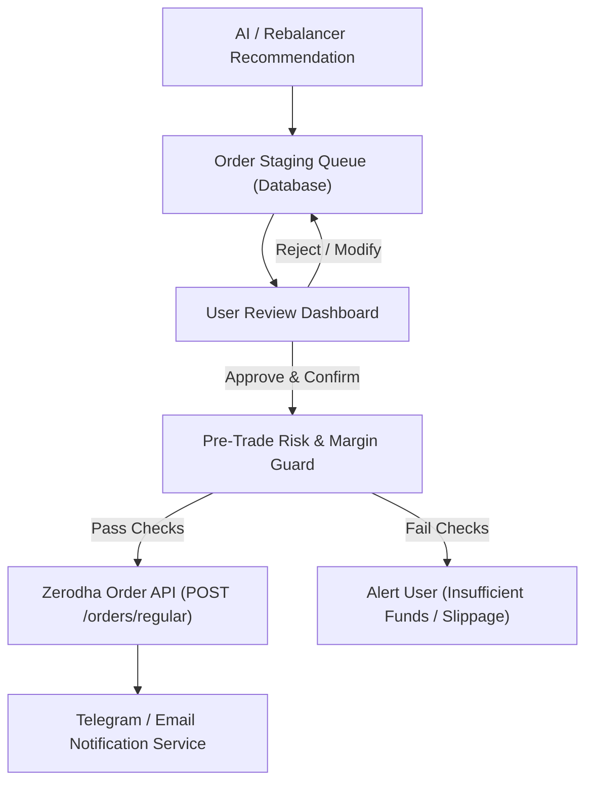

# Implementation Plan - Phase 4: Order Staging Safety Guard & Notification System

---

## 1. Overview & Objectives
Phase 4 enables order execution capability with strict safety guardrails. It introduces an **Order Staging Queue** where AI/rule-based buy and sell suggestions must receive explicit human-in-the-loop approval before executing via Zerodha's `POST /orders/regular` API. Additionally, it implements multi-channel real-time notifications (Telegram / Webhook) for target price alerts, stop-loss breaches, and weekly portfolio summaries.

---

## 2. Component Design & Order Execution Workflow

---

## 3. Key Components to Build

### 3.1 Pre-Trade Safety Guard (`src/services/order_guard.py`)
- **Max Transaction Limit**: Checks that staged order value does not exceed max single-trade ceiling (e.g. ₹50,000).
- **Available Cash Verification**: Checks `GET /user/margins` to ensure sufficient cash balance before submitting buy orders.
- **Limit Price Protection**: Enforces limit order pricing to protect against market slippage.

### 3.2 Zerodha Order Execution Wrapper (`src/services/order_executor.py`)
- Interfaces with Zerodha API:
  - Endpoint: `POST /orders/regular`
  - Parameters: `tradingsymbol`, `exchange`, `transaction_type` (`BUY`/`SELL`), `order_type` (`LIMIT`/`MARKET`), `quantity`, `price`, `product` (`CNC`).
- Stores trade audit history in PostgreSQL database.

### 3.3 Notification & Alerting Service (`src/services/notifications.py`)
- Integration with Telegram Bot API (`python-telegram-bot`) and Webhooks.
- Trigger conditions:
  - Stock price reaches target profit price or breaches stop-loss limit.
  - Weekly portfolio health & performance summary digest.
  - Urgent sector over-concentration notification.

---

## 4. Proposed File Changes

#### [NEW] `src/services/order_guard.py`
- Pre-trade validation limits and safety checks.

#### [NEW] `src/services/order_executor.py`
- Zerodha order execution client & trade log recorder.

#### [NEW] `src/services/notifications.py`
- Telegram bot & webhook notification dispatch engine.

#### [NEW] `src/api/orders.py`
- Endpoints: `GET /api/v1/orders/staged`, `POST /api/v1/orders/approve`, `DELETE /api/v1/orders/cancel`.

#### [MODIFY] `src/ui/app.py`
- Add "Order Staging & Execution Queue" tab with 1-click order submission modals.
