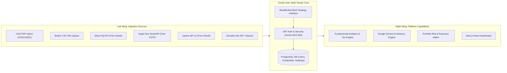
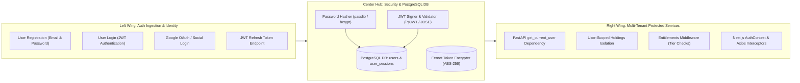
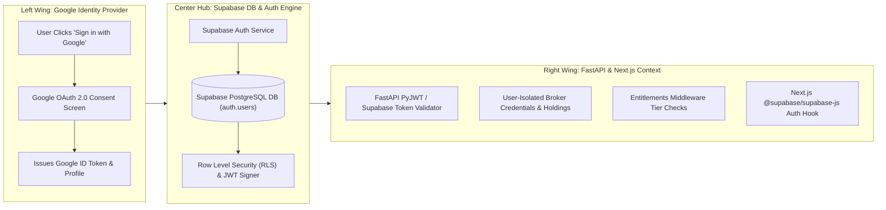

# Implementation Plan — Phase 6: Multi-Tenant Architecture & Universal Ingestion

---

## 1. Overview & Objectives

Phase 6 evolves Portfolio Assistant from a single-user `enctoken` script into a multi-tenant platform accessible to **every trader**, regardless of their broker or API subscription level.

Key capabilities introduced:
1. **Universal Data Ingestion**: CAS (Consolidated Account Statement) PDF parser and Broker CSV uploaders so 100% of traders can import holdings for free.
2. **Multi-Broker API Adapters**: Abstract Strategy pattern supporting free broker APIs (**Dhan HQ**, **Angel One SmartAPI**, **Upstox API v2**) alongside Zerodha.
3. **Multi-Tenant Database & Identity**: PostgreSQL + SQLAlchemy database supporting user signups, JWT authentication, and encrypted token storage (`Fernet`).

---

## 2. Multi-Broker Butterfly Architecture

The system uses a **Butterfly Architecture** where diverse broker APIs and file imports feed into the multi-tenant core engine on the left wing, and process into analytical, AI, and monetization services on the right wing:



### Supported Ingestion Sources

| Source | Access Type | Cost to User | Key Features |
|---|---|---|---|
| **CAS PDF Parser** | File Upload (CDSL/NSDL) | ₹0 / Free | Universal support across all Indian brokers & depositories |
| **CSV Uploader** | File Upload (Zerodha/Groww) | ₹0 / Free | Instant offline portfolio ingestion |
| **Dhan HQ API** | Free REST API (OAuth) | ₹0 / Free | Real-time holdings, positions, and 1-click execution |
| **Angel One SmartAPI** | Free REST API (TOTP/OAuth) | ₹0 / Free | Real-time holdings and market data |
| **Upstox API v2** | Free REST API (OAuth) | ₹0 / Free | Real-time holdings sync |
| **Zerodha Kite Connect** | Paid API / Enctoken | ₹2,000/mo or Enctoken | Official REST API & legacy session fallback |

---

## 3. Database Schema Design (PostgreSQL)

```sql
-- Users Table
CREATE TABLE users (
    id UUID PRIMARY KEY DEFAULT gen_random_uuid(),
    email VARCHAR(255) UNIQUE NOT NULL,
    hashed_password VARCHAR(255) NOT NULL,
    full_name VARCHAR(255),
    tier VARCHAR(20) DEFAULT 'FREE', -- FREE, PRO, ELITE
    is_active BOOLEAN DEFAULT TRUE,
    created_at TIMESTAMP WITH TIME ZONE DEFAULT CURRENT_TIMESTAMP
);

-- User Broker Accounts / Credentials
CREATE TABLE user_broker_accounts (
    id UUID PRIMARY KEY DEFAULT gen_random_uuid(),
    user_id UUID REFERENCES users(id) ON DELETE CASCADE,
    broker_name VARCHAR(50) NOT NULL, -- ZERODHA, DHAN, ANGEL_ONE, UPSTOX, CAS_IMPORT
    encrypted_access_token TEXT,      -- Fernet AES-256 encrypted
    broker_user_id VARCHAR(100),
    is_primary BOOLEAN DEFAULT TRUE,
    created_at TIMESTAMP WITH TIME ZONE DEFAULT CURRENT_TIMESTAMP
);

-- User Holdings Cache
CREATE TABLE user_holdings (
    id UUID PRIMARY KEY DEFAULT gen_random_uuid(),
    user_id UUID REFERENCES users(id) ON DELETE CASCADE,
    tradingsymbol VARCHAR(100) NOT NULL,
    isin VARCHAR(50),
    quantity INT NOT NULL,
    average_price NUMERIC(12, 2) NOT NULL,
    last_price NUMERIC(12, 2),
    close_price NUMERIC(12, 2),
    source_broker VARCHAR(50),
    updated_at TIMESTAMP WITH TIME ZONE DEFAULT CURRENT_TIMESTAMP
);
```

---

## 4. Universal Statement Parsers

### A. CAS (Consolidated Account Statement) PDF Parser
- Parses password-protected CDSL / NSDL PDF statements (`pypdf`, `pdfplumber`).
- Extracts equity holdings, ISINs, quantities, average cost prices, and folio numbers.

### B. Broker CSV Ingestion Engine
- Supports standardized CSV uploads from Zerodha Console, Groww, ICICIdirect, and Paytm Money.
- Auto-detects column headers (`Symbol`, `Qty`, `Buy Avg`, `ISIN`).

---

## 5. User Management, Database & Authentication Subsystem

### A. User Authentication Butterfly Flow



---

### B. Comprehensive User Database Schema (PostgreSQL)

```sql
-- Core User Table
CREATE TABLE users (
    id UUID PRIMARY KEY DEFAULT gen_random_uuid(),
    email VARCHAR(255) UNIQUE NOT NULL,
    hashed_password VARCHAR(255) NOT NULL,
    full_name VARCHAR(255),
    tier VARCHAR(20) DEFAULT 'FREE', -- FREE, PRO, ELITE
    is_active BOOLEAN DEFAULT TRUE,
    is_verified BOOLEAN DEFAULT FALSE,
    created_at TIMESTAMP WITH TIME ZONE DEFAULT CURRENT_TIMESTAMP,
    updated_at TIMESTAMP WITH TIME ZONE DEFAULT CURRENT_TIMESTAMP
);

-- Active User Refresh Sessions (For Secure Token Rotation)
CREATE TABLE user_sessions (
    id UUID PRIMARY KEY DEFAULT gen_random_uuid(),
    user_id UUID REFERENCES users(id) ON DELETE CASCADE,
    refresh_token_hash VARCHAR(255) NOT NULL,
    user_agent TEXT,
    ip_address VARCHAR(50),
    expires_at TIMESTAMP WITH TIME ZONE NOT NULL,
    created_at TIMESTAMP WITH TIME ZONE DEFAULT CURRENT_TIMESTAMP
);

-- Encrypted Broker API Credentials per User
CREATE TABLE user_broker_accounts (
    id UUID PRIMARY KEY DEFAULT gen_random_uuid(),
    user_id UUID REFERENCES users(id) ON DELETE CASCADE,
    broker_name VARCHAR(50) NOT NULL, -- ZERODHA, DHAN, ANGEL_ONE, UPSTOX, CAS_IMPORT
    encrypted_access_token TEXT,      -- Fernet AES-256 encrypted
    broker_user_id VARCHAR(100),
    is_primary BOOLEAN DEFAULT TRUE,
    created_at TIMESTAMP WITH TIME ZONE DEFAULT CURRENT_TIMESTAMP
);

-- User-Scoped Holdings Table
CREATE TABLE user_holdings (
    id UUID PRIMARY KEY DEFAULT gen_random_uuid(),
    user_id UUID REFERENCES users(id) ON DELETE CASCADE,
    tradingsymbol VARCHAR(100) NOT NULL,
    isin VARCHAR(50),
    quantity INT NOT NULL,
    average_price NUMERIC(12, 2) NOT NULL,
    last_price NUMERIC(12, 2),
    close_price NUMERIC(12, 2),
    source_broker VARCHAR(50),
    updated_at TIMESTAMP WITH TIME ZONE DEFAULT CURRENT_TIMESTAMP
);
```

---

### C. Authentication Endpoints & Identity Provider Architecture (Supabase + Google Auth)

The system leverages **Supabase** as the hosted PostgreSQL Database & Auth Engine combined with **Google Cloud** as the external Identity Provider:



1. **Configuration Steps**:
   - Register OAuth 2.0 Client ID & Secret in **Google Cloud Console**.
   - Enter Google Client ID & Secret in **Supabase Dashboard -> Authentication -> Providers -> Google**.
2. **Frontend Ingestion**:
   - Next.js uses `@supabase/supabase-js` `supabase.auth.signInWithOAuth({ provider: 'google' })`.
3. **Backend Validation**:
   - FastAPI inspects Supabase Bearer JWTs using Supabase's JWKS public keys.

---

### D. Frontend Auth State Management (Next.js & Supabase)

- **`@supabase/auth-helpers-nextjs`**: Handles session persistence, server-side rendering (SSR) user checks, and automatic token refresh.
- **Axios Interceptor**: Injects `Authorization: Bearer <supabase_access_token>` into every request to FastAPI.
- **`ProtectedRoute.tsx`**: Redirects non-authenticated sessions to `/login`.

