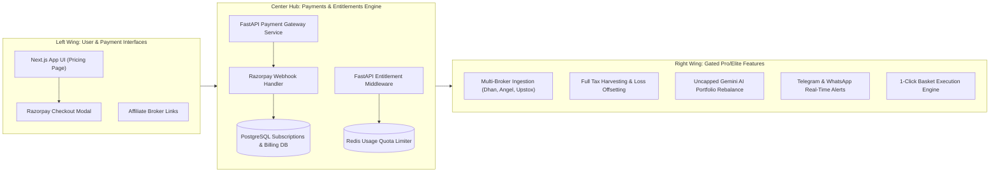

# Implementation Plan — Phase 7: SaaS Monetization & Payments Infrastructure

---

## 1. Overview & Objectives

Phase 7 builds the commercial SaaS monetization infrastructure, subscription pricing models, payment gateway integration (Razorpay), feature entitlement enforcement, and Gemini AI query rate limiting.

Key capabilities introduced:
1. **Tiered Subscription Model**: Free Tier (₹0), Pro Tier (₹299/mo), and Elite Tier (₹799/mo).
2. **Entitlement & Feature Gating Middleware**: FastAPI dependencies (`@require_tier`) protecting advanced endpoints.
3. **Razorpay Payments & Webhook Engine**: Subscription creation, automated recurring billing, signature verification, and instant tier upgrades.
4. **Redis AI Quota Rate Limiter**: Sliding-window counter controlling Gemini LLM API consumption per user tier to protect against API costs.

---

## 2. Subscription Pricing Matrix & Entitlements

| Feature | **Free Tier** (₹0/mo) | **Pro Tier** (₹299/mo or ₹2,999/yr) | **Elite Tier** (₹799/mo or ₹7,999/yr) |
|---|---|---|---|
| **Portfolio Ingestion** | 1 Broker or CAS PDF / CSV Upload | Unlimited Multi-Broker (Dhan, Angel, Upstox, Zerodha) | Unlimited Multi-Broker + Family Accounts |
| **Fundamental Analytics** | Standard (P/E, Market Cap, Sector %) | Advanced (XIRR, CAGR, Overlap Analysis) | Advanced + Benchmark Comparison (vs Nifty 50) |
| **Tax Harvesting** | Basic Tax Breakdown | Full Tax Harvesting Engine (STCG/LTCG Loss Offsetting) | Full Tax Harvesting + CA-Ready Export |
| **AI Advisory (Gemini)** | 3 Teaser Insights / month | 50 AI Portfolio Reviews & Rebalances / month | Unlimited AI Advisory + Custom Strategy Prompts |
| **Alerts & Execution** | Manual Staging | Telegram / Webhook Alerts | Priority Telegram Alerts + 1-Click Basket Execution |
| **Target User** | Casual Investors | Active Equity Investors | HNI / Active Traders / Multi-Account |

---

## 3. Monetization & Payment Butterfly Flow



### Database Tables for Billing

```sql
CREATE TABLE subscriptions (
    id UUID PRIMARY KEY DEFAULT gen_random_uuid(),
    user_id UUID REFERENCES users(id) ON DELETE CASCADE,
    razorpay_subscription_id VARCHAR(100) UNIQUE NOT NULL,
    razorpay_customer_id VARCHAR(100),
    plan_id VARCHAR(50) NOT NULL, -- PRO_MONTHLY, PRO_ANNUAL, ELITE_MONTHLY, ELITE_ANNUAL
    status VARCHAR(50) NOT NULL,  -- active, past_due, canceled, pending
    current_period_start TIMESTAMP WITH TIME ZONE,
    current_period_end TIMESTAMP WITH TIME ZONE,
    created_at TIMESTAMP WITH TIME ZONE DEFAULT CURRENT_TIMESTAMP
);

CREATE TABLE payment_transactions (
    id UUID PRIMARY KEY DEFAULT gen_random_uuid(),
    user_id UUID REFERENCES users(id) ON DELETE CASCADE,
    razorpay_payment_id VARCHAR(100) UNIQUE NOT NULL,
    razorpay_order_id VARCHAR(100),
    amount_in_paisa INT NOT NULL,
    currency VARCHAR(10) DEFAULT 'INR',
    status VARCHAR(50) NOT NULL,
    event_type VARCHAR(100),
    created_at TIMESTAMP WITH TIME ZONE DEFAULT CURRENT_TIMESTAMP
);
```

---

## 4. Middleware & AI Quota Limiter

### A. FastAPI Entitlement Dependency
Routes like `/api/v1/analytics/tax-harvesting` enforce tier requirements:

```python
# backend/src/core/entitlements.py
def require_tier(min_tier: TierEnum):
    def dependency(current_user: User = Depends(get_current_user)):
        if current_user.tier < min_tier:
            raise HTTPException(
                status_code=402,
                detail=f"Feature requires {min_tier.value} tier subscription."
            )
        return current_user
    return dependency
```

### B. Redis Quota Rate Limiter (Gemini API Safeguard)
- Stores monthly query counts per user key: `usage:gemini:{user_id}:{YYYY_MM}`.
- Max limits enforced: Free = 3/month, Pro = 50/month, Elite = 1,000/month.
- Exceeding limit returns `429 Too Many Requests` with reset timestamp details.

---

## 5. Monetization Ecosystem Channels

1. **Broker Affiliate Referrals**: Track broker registration clicks via `/api/v1/affiliates/redirect?broker=dhan` to earn CPA payout per funded trading account.
2. **B2B RIA White-Label SaaS**: Enterprise API plan allowing registered advisors to submit client portfolio JSONs and receive branded PDF AI health reports.
